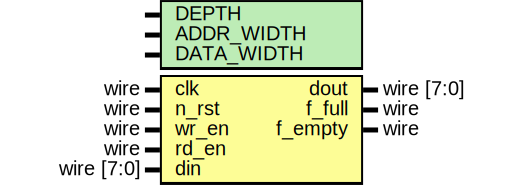

# Entity: FIFO 
- **File**: rtl/FIFO.sv

## Diagram

## Generics

| Generic name | Type | Value | Description |
| ------------ | ---- | ----- | ----------- |
| DEPTH        | Parameter     | 16    | The number of memory array size.            |
| ADDR_WIDTH   | Parameter      | 4     | Address width            |
| DATA_WIDTH   | Parameter     | 8     | The size of each memory array.            |

## Ports

| Port name | Direction | Type       | Description |
| --------- | --------- | ---------- | ----------- |
| clk       | input     | wire       | Clock            |
| n_rst     | input     | wire       | Negative reset            |
| wr_en     | input     | wire       | Enable write            |
| rd_en     | input     | wire       | Enable read            |
| din       | input     | wire [7:0] | Data for storing            |
| dout      | output    | wire [7:0] | Retrieve Data            |
| f_full    | output    | wire       | Full Flag Status            |
| f_empty   | output    | wire       | Empty Flag Status            |

## Signals

| Name     | Type                  | Description |
| -------- | --------------------- | ----------- |
| wr_ptr   | wire [ADDR_WIDTH-1:0] | Write pointer            |
| rd_ptr   | wire [ADDR_WIDTH-1:0] | Read pointer            |
| can_wite | wire                  | Verify writing operation.            |
| can_read | wire                  | Verify reading operation.            |

## Instantiations

- write_pointer_inst: FIFO_Write_Pointer
- read_pointer_inst: FIFO_Read_Pointer
- memory_inst: FIFO_Memory
- state_inst: FIFO_State