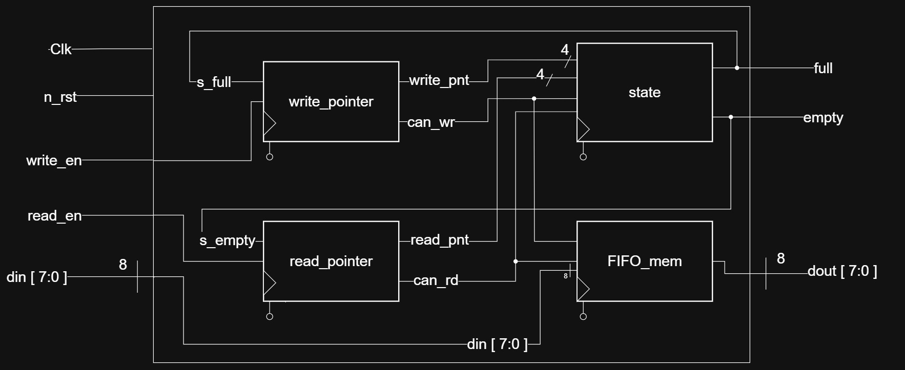
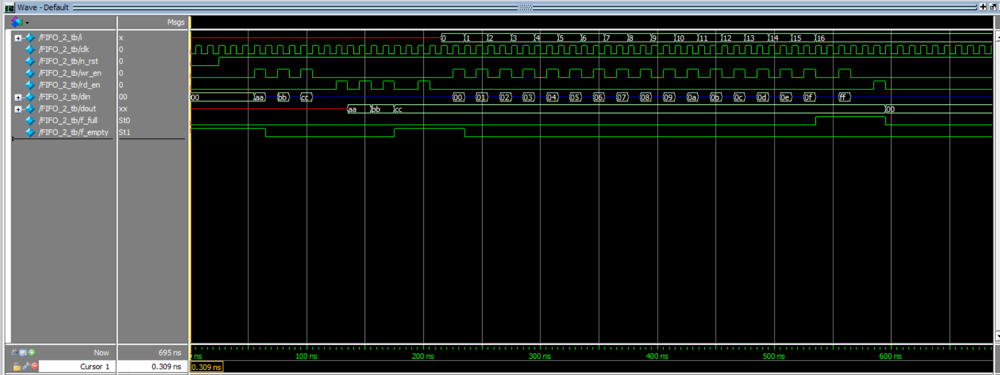

## FIFO Ring 

## Block Diagram

- [FIFO Document](https://github.com/NgoMinhDuc25/FIFO_Synchronous/blob/main/FIFO.md)
- [FIFO_State Document](https://github.com/NgoMinhDuc25/FIFO_Synchronous/blob/main/FIFO_State.md)
- [FIFO_Memory Document](https://github.com/NgoMinhDuc25/FIFO_Synchronous/blob/main/FIFO_Memory.md)
- [FIFO_Write_Pointer Document](https://github.com/NgoMinhDuc25/FIFO_Synchronous/blob/main/FIFO_Write_Pointer.md)
- [FIFO_Read_Pointer Document](https://github.com/NgoMinhDuc25/FIFO_Synchronous/blob/main/FIFO_Read_Pointer.md)

## Waveform

- FIFO Operation: Reset -> Write 3 datapacks -> Read 3 datapacks

- FIFO Operation: Burst write from 00 to 0F and check the full flag (for inserting data FF).

- FIFO Operation: Read when empty

## Simulation with ModelSim

- ModelSim simulation

- [Full simulation result](https://github.com/NgoMinhDuc25/FIFO_Synchronous/blob/main/simulation/wf.pdf)

## Authors

- [@NgoDuc2505](https://github.com/NgoDuc2505)